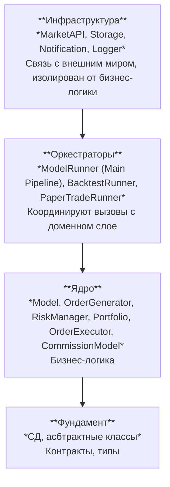

#саморазвитие 
# Архитектура

**Луковичная структура**:

![[Domain.drawio(1).svg]]

![[core.drawio(1).svg]]

![[application.drawio.svg]]

![[infrastructure.drawio.svg]]

[[Алгоритмическая торговля]]