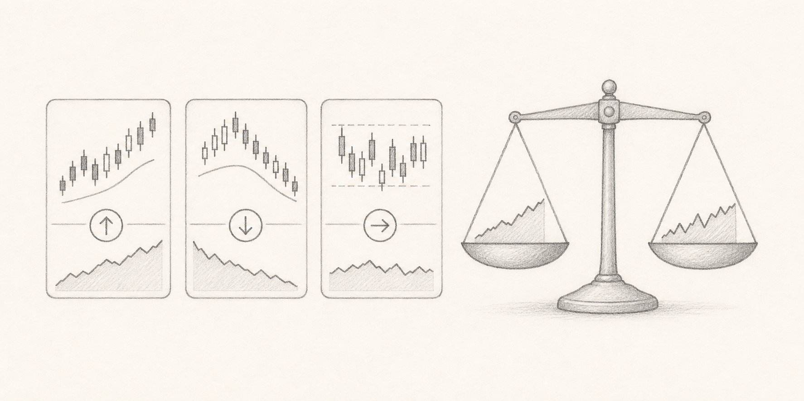
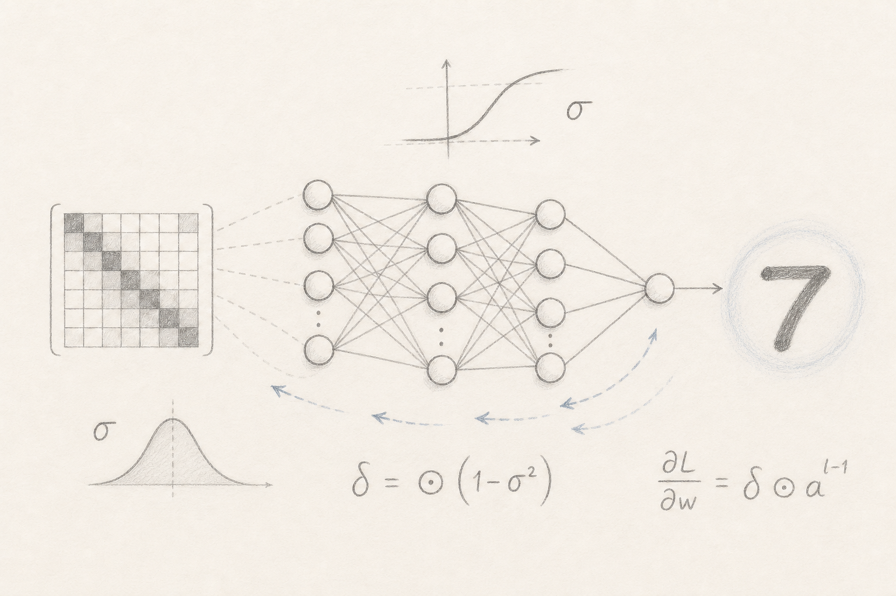
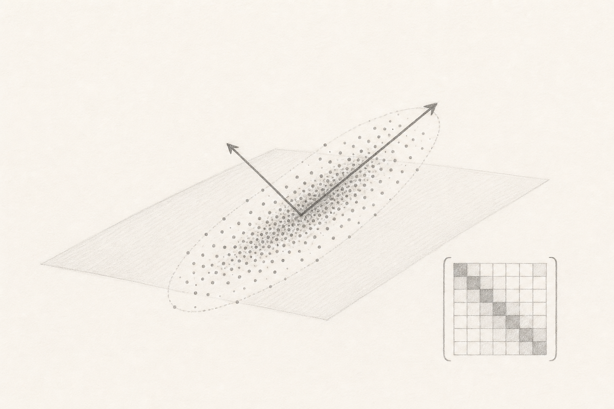

Reproducible explorations for the TimeAnalysis project, grouped by research area.

<section class="category-grid" aria-label="Research categories">
  <a class="research-section-card" href="model-strategies.html">
    
    
      1 study
      Models &amp; Strategies
      Trading models, forecasting approaches, and backtesting workflows.
    
  </a>
  <a class="research-section-card" href="educational.html">
    
    
      4 studies
      Educational
      All current notebooks, tutorials, and mathematical foundations for the research stack.
    
  </a>
  <a class="research-section-card" href="project-infrastructure.html">
    
    
      0 study
      Infrastructure
      Runtime checks and service-level notes for reproducible experiments.
    
  </a>
  <a class="research-section-card" href="exploratory-data-analysis.html">
    
    
      0 study
      EDA
      Data structure, dimensionality reduction, and visualization research.
    
  </a>
</section>
