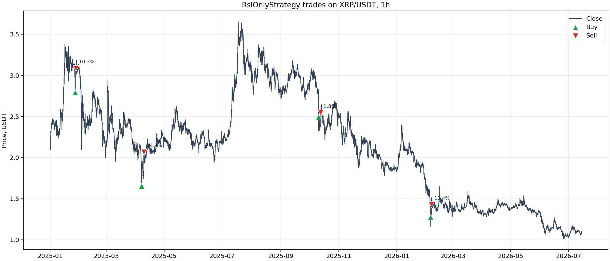
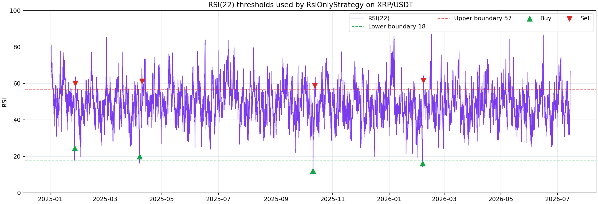
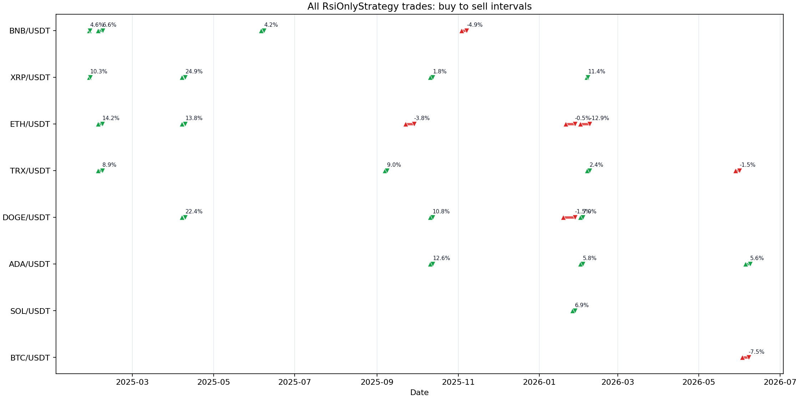
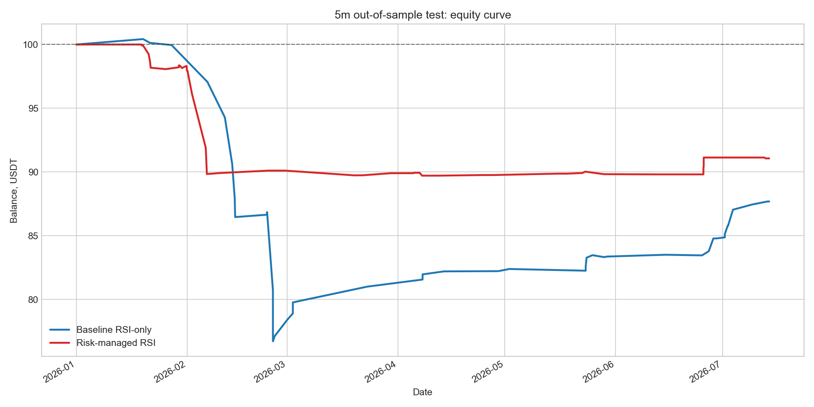
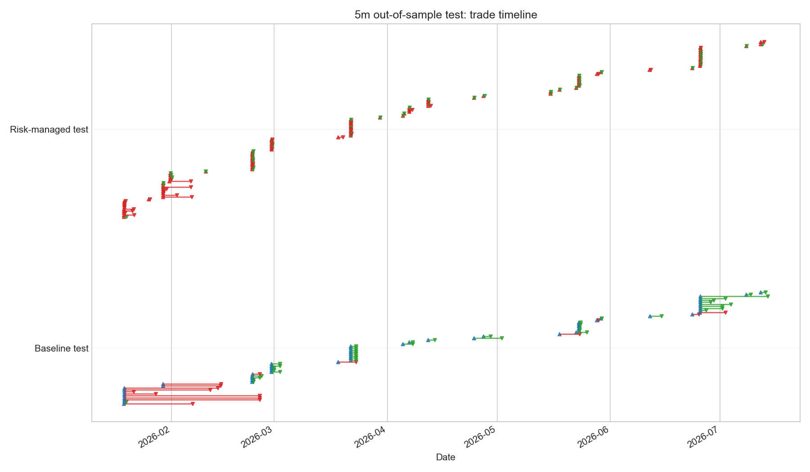
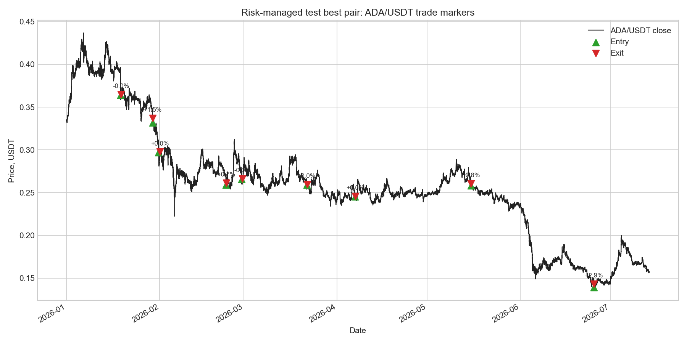

## Goal

This experiment builds the smallest useful RSI strategy for Freqtrade: only one
indicator, no trend filters, no extra guards, and no ML. The strategy is
long-only and mean-reverting:

- enter long when RSI crosses below the lower RSI boundary;
- exit long when RSI crosses above the upper RSI boundary;
- keep ROI effectively disabled with `minimal_roi = {"0": 100}`;
- keep an emergency-wide stoploss at `-0.99`, so normal exits are RSI exits.

The implementation lives in `user_data/strategies/RsiOnlyStrategy.py`, with a
dedicated config in `user_data/config_rsi_only_1h.json`.

## Can Freqtrade optimize RSI parameters?

Yes. Freqtrade can optimize RSI boundaries and RSI period internally with
Hyperopt. The strategy exposes the parameters as `IntParameter`:

| Parameter | Hyperopt space | Range | Best value |
|---|---:|---:|---:|
| `buy_rsi_period` | `buy` | 7-30 | 22 |
| `buy_rsi_lower` | `buy` | 10-45 | 18 |
| `sell_rsi_upper` | `sell` | 55-90 | 57 |

The period is the subtle part: because RSI period changes the indicator itself,
the strategy calculates RSI columns with `self.buy_rsi_period.range`. This is a
standard Freqtrade pattern for optimizing indicator periods without recalculating
the whole dataframe incorrectly for every epoch.

## Reproduction

The commands below were run from `C:\WorkPrograms\TimeAnalysis`.

```powershell
uv sync --dev
```

Freqtrade Hyperopt needs `optuna`, `cmaes`, and `filelock` in addition to the
normal bot dependencies. These are now tracked in `pyproject.toml`, so a normal
`uv sync --dev` is enough.

```powershell
uv run freqtrade list-strategies --userdir user_data
.\.venv\Scripts\ruff.exe check user_data\strategies\RsiOnlyStrategy.py
```

`--strategy-path user_data/strategies` is intentionally omitted. With
`--userdir user_data`, Freqtrade already scans `user_data/strategies`; passing
the same path again causes duplicate strategy entries.

```powershell
uv run freqtrade download-data --userdir user_data --config user_data/config_rsi_only_1h.json --timeframes 1h --timerange 20250101-20260714
```

Downloaded data:

- exchange: Binance spot;
- timeframe: `1h`;
- pairs: `BTC/USDT`, `ETH/USDT`, `BNB/USDT`, `XRP/USDT`, `SOL/USDT`,
  `TRX/USDT`, `DOGE/USDT`, `ADA/USDT`, `LINK/USDT`, `AVAX/USDT`;
- downloaded candles: 13,434 per pair.

Hyperopt command:

```powershell
uv run freqtrade hyperopt --userdir user_data --config user_data/config_rsi_only_1h.json --strategy RsiOnlyStrategy --timeframe 1h --timerange 20250101-20260714 --spaces buy sell --hyperopt-loss ProfitDrawDownHyperOptLoss -e 300 --random-state 42 --min-trades 10 -j -2
```

Best Hyperopt epoch: 277/300, objective `-56.89194`, 26 trades, 19 wins, 7
losses.

Final backtest command:

```powershell
uv run freqtrade backtesting --userdir user_data --config user_data/config_rsi_only_1h.json --strategy RsiOnlyStrategy --timeframe 1h --timerange 20250101-20260714 --export trades --breakdown month --cache none
```

Artifacts:

- Hyperopt result: `user_data/hyperopt_results/strategy_RsiOnlyStrategy_2026-07-14_21-55-13.fthypt`;
- exported parameters: `user_data/strategies/RsiOnlyStrategy.json`;
- final backtest: `user_data/backtest_results/backtest-result-2026-07-14_22-02-06.zip`.

## Visual inspection

Freqtrade has two practical ways to inspect buy and sell points.

The preferred interactive path is FreqUI:

```powershell
uv run freqtrade webserver --userdir user_data --config user_data/config_rsi_only_1h.json
```

Then open `http://127.0.0.1:8080`, log in with the local credentials from the
config, and use the Backtesting view. FreqUI can load previous backtest results
from `user_data/backtest_results`, including
`backtest-result-2026-07-14_22-02-06.zip`. Open a pair chart from that result
and load the strategy plot configuration. `RsiOnlyStrategy` exposes an RSI
subplot with `rsi`, `rsi_lower`, and `rsi_upper`, so entries, exits, and RSI
thresholds can be inspected on the same chart.

For the static research report, the saved backtest zip and OHLCV feather data
were converted into PNG figures.



The best pair was `XRP/USDT`, so the first plot focuses on its four trades.
Green triangles are entries, red triangles are exits, and labels show trade
profit.



The RSI plot shows why these trades fired: entries happen when RSI(22) crosses
below the lower boundary `18`, and exits happen when RSI(22) crosses above the
upper boundary `57`.



The timeline plot shows all backtest trades as buy-to-sell intervals. Green
intervals are profitable trades, red intervals are losing trades.

The legacy command-line plotting path also exists:

```powershell
uv run freqtrade plot-dataframe --userdir user_data --config user_data/config_rsi_only_1h.json --strategy RsiOnlyStrategy --timeframe 1h --pairs XRP/USDT --export-filename user_data/backtest_results/backtest-result-2026-07-14_22-02-06.zip
```

Freqtrade documentation currently recommends FreqUI over `plot-dataframe` for
plotting, because the CLI plotting commands are in maintenance mode.

## In-sample bias warning

The `+60.71%` result below is useful as a first proof-of-concept, but it is
likely optimistic. The same timerange was used for Hyperopt and for the final
backtest, so the strategy was trained and evaluated on the same candles. This
can overfit RSI boundaries and period selection to historical noise. Treat the
1h result as an in-sample research result, not as evidence that the strategy is
robust out-of-sample.

## Backtest results

The final backtest automatically loaded `RsiOnlyStrategy.json`.

| Metric | Value |
|---|---:|
| Backtest period | 2025-01-05 04:00:00 - 2026-07-14 00:00:00 |
| Starting balance | 100 USDT |
| Final balance | 160.714 USDT |
| Absolute profit | 60.714 USDT |
| Total profit | 60.71% |
| Market change | -52.46% |
| Trades | 26 |
| Win / draw / loss | 19 / 0 / 7 |
| Win rate | 73.1% |
| Average profit per trade | 5.79% |
| Average duration | 3 days, 2:18:00 |
| Profit factor | 4.60 |
| Sharpe | 0.57 |
| Sortino | 0.99 |
| Calmar | 30.76 |
| SQN | 3.20 |
| Max account drawdown | 11.516 USDT / 6.81% |
| Drawdown duration | 119 days, 14:00:00 |
| Best pair | XRP/USDT, 20.05% |
| Worst pair | BTC/USDT, -4.02% |

Per-pair result:

| Pair | Trades | Profit, USDT | Profit | Win rate |
|---|---:|---:|---:|---:|
| XRP/USDT | 4 | 20.055 | 20.05% | 100.0% |
| DOGE/USDT | 4 | 16.631 | 16.63% | 75.0% |
| ADA/USDT | 3 | 12.009 | 12.01% | 100.0% |
| TRX/USDT | 4 | 7.826 | 7.83% | 75.0% |
| SOL/USDT | 1 | 3.494 | 3.49% | 100.0% |
| BNB/USDT | 4 | 3.227 | 3.23% | 75.0% |
| ETH/USDT | 5 | 1.497 | 1.50% | 40.0% |
| LINK/USDT | 0 | 0.000 | 0.00% | 0.0% |
| AVAX/USDT | 0 | 0.000 | 0.00% | 0.0% |
| BTC/USDT | 1 | -4.023 | -4.02% | 0.0% |

Monthly breakdown:

| Month | Trades | Profit, USDT | Win / loss |
|---|---:|---:|---:|
| 2025-01 | 2 | 4.965 | 2 / 0 |
| 2025-02 | 3 | 10.345 | 3 / 0 |
| 2025-03 | 0 | 0.000 | 0 / 0 |
| 2025-04 | 3 | 23.482 | 3 / 0 |
| 2025-05 | 0 | 0.000 | 0 / 0 |
| 2025-06 | 1 | 1.905 | 1 / 0 |
| 2025-07 | 0 | 0.000 | 0 / 0 |
| 2025-08 | 0 | 0.000 | 0 / 0 |
| 2025-09 | 2 | 2.380 | 1 / 1 |
| 2025-10 | 3 | 12.018 | 3 / 0 |
| 2025-11 | 1 | -2.485 | 0 / 1 |
| 2025-12 | 0 | 0.000 | 0 / 0 |
| 2026-01 | 3 | 2.477 | 1 / 2 |
| 2026-02 | 5 | 7.444 | 4 / 1 |
| 2026-03 | 0 | 0.000 | 0 / 0 |
| 2026-04 | 0 | 0.000 | 0 / 0 |
| 2026-05 | 1 | -0.811 | 0 / 1 |
| 2026-06 | 2 | -1.005 | 1 / 1 |

## 5m train/test extension

To reduce the in-sample bias, the next experiment uses `5m` candles and a fixed
train/test split:

- exchange: Binance spot;
- timeframe: `5m`;
- pairs: the same 10 USDT pairs used by the 1h experiment;
- data range: `2025-01-01` - `2026-07-14`;
- train: `2025-01-01` - `2025-12-31`;
- test: `2026-01-01` - `2026-07-14`;
- `max_open_trades = 10`;
- test parameters are not reoptimized.

The new files are:

- `user_data/config_rsi_only_5m.json`;
- `user_data/config_rsi_risk_managed_5m.json`;
- `user_data/strategies/RsiOnly5mStrategy.py`;
- `user_data/strategies/RsiOnlyRiskManaged5mStrategy.py`.

The risk-managed version still uses RSI as the only market indicator, but it is
not a strict RSI-only exit system anymore. It adds Freqtrade risk controls:
optimized ROI, stoploss, trailing stop, and protections (`CooldownPeriod`,
`MaxDrawdown`, `LowProfitPairs`). Final risk-managed backtests were run with
`--enable-protections`.

Downloaded `5m` data contains 10 `*-5m.feather` files with 160,999 candles per
pair, from `2025-01-01 00:00:00+00:00` to `2026-07-14 00:30:00+00:00`.

### 5m reproduction commands

```powershell
uv run freqtrade download-data --userdir user_data --config user_data/config_rsi_risk_managed_5m.json --timeframes 5m --timerange 20250101-20260714
```

Baseline RSI-only Hyperopt on train:

```powershell
uv run freqtrade hyperopt --userdir user_data --config user_data/config_rsi_only_5m.json --strategy RsiOnly5mStrategy --timeframe 5m --timerange 20250101-20260101 --spaces buy sell --hyperopt-loss ProfitDrawDownHyperOptLoss -e 300 --random-state 42 --min-trades 50 -j 8 --analyze-per-epoch
```

Risk-managed Hyperopt on train:

```powershell
uv run freqtrade hyperopt --userdir user_data --config user_data/config_rsi_risk_managed_5m.json --strategy RsiOnlyRiskManaged5mStrategy --timeframe 5m --timerange 20250101-20260101 --spaces buy sell roi stoploss trailing protection --hyperopt-loss ProfitDrawDownHyperOptLoss -e 300 --random-state 42 --min-trades 50 -j 8 --analyze-per-epoch
```

The baseline run completed all 300 epochs. The risk-managed search hit Windows
resource/time limits after saving 41 epochs, so the risk-managed result should
be treated as a partial pilot optimization, not as a fully comparable 300-epoch
search.

Backtests:

```powershell
uv run freqtrade backtesting --userdir user_data --config user_data/config_rsi_only_5m.json --strategy RsiOnly5mStrategy --timeframe 5m --timerange 20250101-20260101 --export trades --breakdown month --cache none --notes rsi_5m_baseline_train
uv run freqtrade backtesting --userdir user_data --config user_data/config_rsi_only_5m.json --strategy RsiOnly5mStrategy --timeframe 5m --timerange 20260101-20260714 --export trades --breakdown month --cache none --notes rsi_5m_baseline_test
uv run freqtrade backtesting --userdir user_data --config user_data/config_rsi_risk_managed_5m.json --strategy RsiOnlyRiskManaged5mStrategy --timeframe 5m --timerange 20250101-20260101 --export trades --breakdown month --cache none --enable-protections --notes rsi_5m_risk_train
uv run freqtrade backtesting --userdir user_data --config user_data/config_rsi_risk_managed_5m.json --strategy RsiOnlyRiskManaged5mStrategy --timeframe 5m --timerange 20260101-20260714 --export trades --breakdown month --cache none --enable-protections --notes rsi_5m_risk_test
```

### 5m optimized parameters

Baseline RSI-only, trained on 2025:

| Parameter | Value |
|---|---:|
| `buy_rsi_period` | 19 |
| `buy_rsi_lower` | 13 |
| `sell_rsi_upper` | 79 |
| `minimal_roi` | `{"0": 100}` |
| `stoploss` | `-0.99` |
| `max_open_trades` | 10 |

Risk-managed RSI, partial 41-epoch pilot trained on 2025:

| Parameter | Value |
|---|---:|
| `buy_rsi_period` | 22 |
| `buy_rsi_lower` | 16 |
| `sell_rsi_upper` | 69 |
| `minimal_roi` | `{"0": 0.161, "30": 0.029, "83": 0.015, "148": 0}` |
| `stoploss` | `-0.342` |
| `trailing_stop` | `true` |
| `trailing_stop_positive` | `0.184` |
| `trailing_stop_positive_offset` | `0.186` |
| `protection_cooldown_stop_duration` | 20 |
| `protection_max_allowed_drawdown` | 0.089 |
| `protection_max_drawdown_stop_duration` | 215 |
| `protection_low_profit_required_profit` | 0.009 |
| `protection_low_profit_stop_duration` | 36 |
| `max_open_trades` | 10 |

### 5m baseline RSI-only

| Split | Trades | Profit | Max drawdown | Win rate | Profit factor | Sharpe | Sortino | Best pair | Worst pair |
|---|---:|---:|---:|---:|---:|---:|---:|---|---|
| Train | 57 | 53.169 USDT / 53.17% | 2.276 USDT / 2.07% | 66.7% | 10.06 | 1.22 | 8.57 | ADA/USDT, 9.18% | SOL/USDT, 1.58% |
| Test | 57 | -12.314 USDT / -12.31% | 23.712 USDT / 23.61% | 71.9% | 0.51 | -1.04 | -0.82 | XRP/USDT, 1.26% | SOL/USDT, -2.47% |

The baseline overfit signal is clear: strong train performance did not survive
the untouched 2026 test window. The win rate stayed high, but the few losing
trades were large enough to dominate total PnL.

### 5m risk-managed RSI

| Split | Trades | Profit | Max drawdown | Win rate | Profit factor | Sharpe | Sortino | Best pair | Worst pair |
|---|---:|---:|---:|---:|---:|---:|---:|---|---|
| Train | 94 | -1.212 USDT / -1.21% | 8.687 USDT / 8.54% | 60.6% | 0.91 | -0.10 | -0.08 | BNB/USDT, 1.60% | DOGE/USDT, -3.49% |
| Test | 89 | -8.936 USDT / -8.94% | 10.291 USDT / 10.29% | 57.3% | 0.22 | -1.99 | -1.43 | ADA/USDT, 0.54% | AVAX/USDT, -3.08% |

The risk-managed test lost less money and had a smaller account drawdown than
the baseline test, but it also had a worse profit factor and worse Sharpe /
Sortino. Because the risk-managed Hyperopt was partial, this is best read as a
directional robustness check rather than a final verdict on the risk controls.

### 5m test comparison

| Metric | Baseline RSI-only | Risk-managed RSI |
|---|---:|---:|
| Test profit | -12.314 USDT / -12.31% | -8.936 USDT / -8.94% |
| Max account drawdown | 23.712 USDT / 23.61% | 10.291 USDT / 10.29% |
| Trades | 57 | 89 |
| Win rate | 71.9% | 57.3% |
| Profit factor | 0.51 | 0.22 |
| Sharpe | -1.04 | -1.99 |
| Sortino | -0.82 | -1.43 |
| Market change | -34.67% | -34.67% |

Monthly test breakdown:

| Month | Baseline trades | Baseline profit, USDT | Risk trades | Risk profit, USDT |
|---|---:|---:|---:|---:|
| 2026-01 | 3 | -0.043 | 18 | -2.057 |
| 2026-02 | 13 | -22.843 | 22 | -7.840 |
| 2026-03 | 14 | 3.887 | 11 | -0.201 |
| 2026-04 | 4 | 1.216 | 11 | -0.145 |
| 2026-05 | 10 | 1.144 | 12 | 0.068 |
| 2026-06 | 5 | 1.426 | 12 | 1.306 |
| 2026-07 | 8 | 2.899 | 3 | -0.067 |



The equity curve shows the main difference: risk controls reduced the February
capital drop, while the baseline recovered more later in the test window but
still finished lower overall.



The timeline shows that the risk-managed version trades more frequently and
closes many positions quickly through ROI/trailing/protection-influenced
behavior. The baseline trades less often but holds some losing February
positions longer.



The best risk-managed test pair was `ADA/USDT`, but even that pair only
contributed `+0.537 USDT` (`+0.54%`). This reinforces that the out-of-sample edge
was weak in the 2026 test window.

### 5m conclusion

The train/test split changes the interpretation materially. The original 1h
result and the 5m baseline train result both look attractive in-sample, but the
untouched 2026 test window is negative. The risk-managed variant reduced test
drawdown from `23.61%` to `10.29%` and improved absolute test PnL from `-12.31%`
to `-8.94%`, but it did not produce a profitable or statistically convincing
strategy. The next research step should be a proper walk-forward optimization
with multiple rolling windows, not a single train/test split.

### Stoploss -5% sensitivity check

After the train/test experiment, a fixed `5%` stoploss was checked against the
current optimized parameters. In Freqtrade this is configured as
`stoploss = -0.05`; a positive `0.05` is not the strategy value.

This was a post-hoc sensitivity check, not a fresh Hyperopt run. The test used a
temporary config-level stoploss override, which Freqtrade applies after loading
strategy parameters from `*.json`.

| Strategy / window | Original result | With `stoploss = -0.05` | Change |
|---|---:|---:|---|
| `RsiOnly5mStrategy`, 2026 test | -12.31%, DD 23.61% | +4.93%, DD 8.00% | Better |
| `RsiOnlyRiskManaged5mStrategy`, 2026 test | -8.94%, DD 10.29% | -5.01%, DD 6.41% | Smaller loss, smaller drawdown |
| `RsiOnlyStrategy`, 1h in-sample full period | +60.71%, DD 6.81% | +3.08%, DD 26.30% | Worse |

Detailed `5m` test metrics:

| Strategy | Trades | Profit | Max drawdown | Win rate | Profit factor | Sharpe | Sortino |
|---|---:|---:|---:|---:|---:|---:|---:|
| Baseline RSI-only, original | 57 | -12.314 USDT / -12.31% | 23.712 USDT / 23.61% | 71.9% | 0.51 | -1.04 | -0.82 |
| Baseline RSI-only, `-5%` stoploss | 69 | 4.934 USDT / 4.93% | 8.004 USDT / 8.00% | 63.8% | 1.46 | 1.07 | 3.07 |
| Risk-managed RSI, original | 89 | -8.936 USDT / -8.94% | 10.291 USDT / 10.29% | 57.3% | 0.22 | -1.99 | -1.43 |
| Risk-managed RSI, `-5%` stoploss | 90 | -5.006 USDT / -5.01% | 6.413 USDT / 6.41% | 53.3% | 0.34 | -2.44 | -2.17 |

The fixed `-5%` stoploss is promising for the `5m` baseline because it turns the
2026 test from negative to positive and cuts drawdown sharply. However, it does
not transfer cleanly to the 1h strategy, and the risk-managed strategy remains
negative. Since this check was made after seeing the test result, it also starts
to use the test set as a design signal. The next defensible experiment is to add
`stoploss` to Hyperopt on the train window only, then evaluate the selected
stoploss on a fresh untouched test window or through rolling walk-forward
splits.

Artifacts from this check:

- `user_data/backtest_results/backtest-result-2026-07-15_12-11-46.zip`:
  `RsiOnly5mStrategy`, 2026 test, `stoploss = -0.05`;
- `user_data/backtest_results/backtest-result-2026-07-15_12-12-28.zip`:
  `RsiOnlyRiskManaged5mStrategy`, 2026 test, `stoploss = -0.05`;
- `user_data/backtest_results/backtest-result-2026-07-15_12-13-52.zip`:
  `RsiOnlyStrategy`, 1h full period, `stoploss = -0.05`.

## Notes and limitations

The optimized strategy is very selective: only 26 trades over about 554
backtest days. That selectivity is probably why drawdown looks controlled, but
it also means the estimate is fragile.

This is an in-sample Hyperopt plus final backtest on the same timerange. The
numbers are useful for checking whether the RSI-only idea is worth deeper
research, but they are not evidence of live robustness. A better next experiment
is a walk-forward split: optimize on an earlier window, then test untouched data
from a later window.
